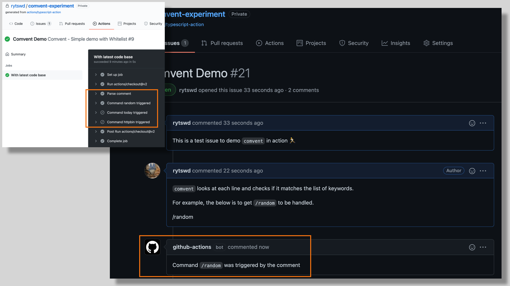

# ⚡️ Comvent

> Simple control for GitHub Actions to handle "comment event" - a building block for rich comment handling

[](build-status) | [](mit) | [](releases)



<!--Placeholder-->

[build-status]: https://github.com/rytswd/comvent/actions
[mit]: https://opensource.org/licenses/MIT
[releases]: https://github.com/rytswd/comvent/releases

## 🌅 Contents

- [Examples](#-examples)
- [Action Inputs](#-action-inputs)
- [Comvent Configuration File](#%EF%B8%8F-comvent-configuration-file)
- [Action Outputs](#-action-outputs)

## 🚀 Examples

Comvent is being used in this repo as well. You can check out [this issue](https://github.com/rytswd/comvent/issues/24) and comment to see the actual Comvent offerings in action! 🏃

### ChatBot Setup

It is pretty easy to provide ChatBot experience in PR / Issue comment.

You can add Comvent setup at the beginning of the `issue_comment` event, and use its output to run any step afterwards based on the patterns found. The below is an example to simply repsond to a comment.

> `.github/workflows/chatbot.yaml`

```yaml
- name: Handle with Comvent
  uses: rytswd/comvent@v0.2
  id: comvent
  with:
    token: ${{ secrets.GITHUB_TOKEN }}
    config-path: .github/comvent-chatbot.yaml

# The below only runs when Comvent finds matching comment.
# This assumes that Comvent config holding 'command-random' as a keyword.
- if: steps.comvent.outputs.command-random != ''
  name: Handle random event
  uses: actions/github-script@v3
  with:
    github-token: ${{ secrets.GITHUB_TOKEN }}
    # An example of responding to a comment.
    script: |
      const comment = `Command \`/random\` was triggered by the comment`;

      github.issues.createComment({
        issue_number: context.issue.number,
        owner: context.repo.owner,
        repo: context.repo.repo,
        body: comment
      })

#
# You can repeat similar handling based on the Comvent config.
#
```

<details>
<summary>Click to view full example</summary>

> `.github/workflows/chatbot.yaml`

```yaml
name: ChatBot
on:
  issue_comment:
    # This shouldn't be called for comment deletion
    types:
      - created
      - edited

jobs:
  chatbot:
    name: With latest code base
    runs-on: ubuntu-latest

    steps:
      - name: Handle with Comvent
        uses: rytswd/comvent@v0.2
        id: comvent
        with:
          token: ${{ secrets.GITHUB_TOKEN }}
          config-path: .github/comvent-chatbot.yaml

      # The below only runs when Comvent finds matching comment.
      # This assumes that Comvent config holding 'command-random' as a keyword.
      - if: steps.comvent.outputs.command-random != ''
        name: Handle random event
        uses: actions/github-script@v3
        with:
          github-token: ${{ secrets.GITHUB_TOKEN }}
          # An example of responding to a comment.
          script: |
            const comment = `Command \`/random\` was triggered by the comment`;

            github.issues.createComment({
              issue_number: context.issue.number,
              owner: context.repo.owner,
              repo: context.repo.repo,
              body: comment
            })

      #
      # You can repeat similar handling based on the Comvent config.
      #
```

</details>

As used above, Comvent configuration needs to define the keywords to find patterns.

> `.github/comvent-chatbot.yaml`

```yaml
---
version: 0.2.0

trigger: default

keywords:
  - name: command-random
    value: '^\/random$' # Regex which looks for a comment with '/random'
  - name: some-other-command
    value: 'some arbitrary regex setup'

  # You can have as many regex setup as you need.
```

### Handle Abusive Content

You can add a simple automation to monitor abusive comments.

Using [github-script](https://github.com/actions/github-script), we can remove such comment, while leaving a comment about the deletion.

> `.github/workflows/abuse-monitor.yaml`

```yaml
- name: Handle with Comvent
  uses: rytswd/comvent@v0.2
  id: comvent
  with:
    token: ${{ secrets.GITHUB_TOKEN }}
    config-path: .github/comvent-abuse-monitor.yaml

# The below only runs when Comvent finds matching comment.
# This assumes that Comvent config holding 'some-abusive-content' as a keyword.
- if: steps.comvent.outputs.some-abusive-content != ''
  name: Handle some abusive content
  uses: actions/github-script@v3
  with:
    github-token: ${{ secrets.GITHUB_TOKEN }}
    # An example of removing the abusive comment, and leaving a comment about the deletion.
    script: |
      github.issues.deleteComment({
        owner: context.repo.owner,
        repo: context.repo.repo,
        comment_id: ${{ github.event.comment.id }}
      })

      const comment = `Found abusive comment! 😰
      The comment was thus removed.`;

      github.issues.createComment({
        issue_number: context.issue.number,
        owner: context.repo.owner,
        repo: context.repo.repo,
        body: comment
      })
```

<details>
<summary>Click to view full example</summary>

> `.github/workflows/abuse-monitor.yaml`

```yaml
name: Monitor Abusive Comments
on:
  issue_comment:
    # This shouldn't be called for comment deletion
    types:
      - created
      - edited

jobs:
  abuse-monitor:
    name: With latest code base
    runs-on: ubuntu-latest

    steps:
      - name: Handle with Comvent
        uses: rytswd/comvent@v0.2
        id: comvent
        with:
          token: ${{ secrets.GITHUB_TOKEN }}
          config-path: .github/comvent-abuse-monitor.yaml

      # The below only runs when Comvent finds matching comment.
      # This assumes that Comvent config holding 'some-abusive-content' as a keyword.
      - if: steps.comvent.outputs.some-abusive-content != ''
        name: Handle some abusive content
        uses: actions/github-script@v3
        with:
          github-token: ${{ secrets.GITHUB_TOKEN }}
          # An example of removing the abusive comment, and leaving a comment about the deletion.
          script: |
            github.issues.deleteComment({
              owner: context.repo.owner,
              repo: context.repo.repo,
              comment_id: ${{ github.event.comment.id }}
            })

            const comment = `Found abusive comment! 😰
            The comment was thus removed.`;

            github.issues.createComment({
              issue_number: context.issue.number,
              owner: context.repo.owner,
              repo: context.repo.repo,
              body: comment
            })
```

</details>

As used above, Comvent configuration needs to define the keywords to find patterns.

> `.github/comvent-abuse-monitor.yaml`

```yaml
---
version: 0.2.0

trigger: default

keywords:
  - name: some-abusive-content
    value: 'some abusive content' # Find abusive comment
```

## 🧪 Action Inputs

| Name                | Description                                                                                                                                                                                                                               | IsRequired |
| ------------------- | ----------------------------------------------------------------------------------------------------------------------------------------------------------------------------------------------------------------------------------------- | :--------: |
| `token`             | `GITHUB_TOKEN` or Personal Access Token with `repo` scope                                                                                                                                                                                 |    Yes     |
| `config-path`       | Path to Comvent configuration file. You can find more about the configuration below. Defaults to `.github/comvent-setup.yaml`. Regardless of your GitHub Action setup, this assumes the current directory is the root of your repository. |            |
| `config-check-only` | A flag to run only Comvent configuration setup. Used for testing only.                                                                                                                                                                    |            |

## ⚙️ Comvent Configuration File

Comvent uses a dedicated YAML file for its configuration.

### Example

The below is a copy of [`.github/comvent-setup.yaml`](https://github.com/rytswd/comvent/blob/main/.github/comvent-setup.yaml).

```yaml
---
# version determines the supported values and how they are handled. The current
# latest is 0.2.0, and if not speccified, it infers the latest version.
version: 0.2.0

# trigger can accept either `default` or `specific`.
# - default:  all comments will be handled by Comvent, except for those from
#             users listed under users.inactive list below.
# - specific: only comments made by specified users under users.active list
#             below gets handled by Comvent.
trigger: default

# users is consisted of `active` or `inactive` user list. Providing a list
# which does not match the `trigger` setup above is simply ignored.
users:
  active:
    - rytswd # This is no-op, as the `trigger` above is set to `default`
  inactive:
    - random-user
    - another-user

# keywords is a list comprised of `name` and `value` fields.
# - name:  used for Comvent output, and thus should not include whitespace.
# - value: regex value to search for. The search takes place for each line in
#          the comment.
keywords:
  - name: command-random
    value: '^\/random$' # Regex which looks for a comment with '/random'
```

You can find a few examples in [`.github/`](https://github.com/rytswd/comvent/tree/main/.github) directory.

### Configuration Details

| Key        | Description                                                                                                                                                                   | Default   |
| ---------- | ----------------------------------------------------------------------------------------------------------------------------------------------------------------------------- | --------- |
| `version`  | The version of configuration spec. The latest is `0.2.0`.                                                                                                                     | `0.2.0`   |
| `trigger`  | When to handle Comvent. `default` means event triggered by anyone would be handled by Comvent, and `specific` means only specified users' comments would be handled.          | `default` |
| `users`    | Stanza with `active` or `inactive` with list of GitHub user accounts. `active` list is only used for `specific` trigger setup, and `inactive` is for `default` trigger setup. |           |
| `keywords` | Keywords to process comment based on. Each `value` is regex searched in comment, for each line.                                                                               |           |

## 🍸 Action Outputs

Comvent provides the outputs with which you can tweak your Action worrkflow.

As the outputs will be based on the [Comvent Configuration File](#%EF%B8%8F-comvent-configuration-file) provided to Comvent, the below table is based on the following simple configuration as an example.

> `.github/comvent-config.yaml`

```yaml
---
version: 0.2.0

trigger: default

keywords:
  - name: command-random
    value: '^\/random$'
  - name: some-other-command
    value: 'some arbitrary regex setup'
```

| Name                           | Description                                                                                                     |
| ------------------------------ | --------------------------------------------------------------------------------------------------------------- |
| `comvent-found-any-match`      | Special keyword provided by Comvent by default. If any keyword is matched, this will provide `found` as output. |
| (Example) `command-random`     | When the regex value matches with the comment line, this will output `found`.                                   |
| (Example) `some-other-command` | When the regex value matches with the comment line, this will output `found`.                                   |
